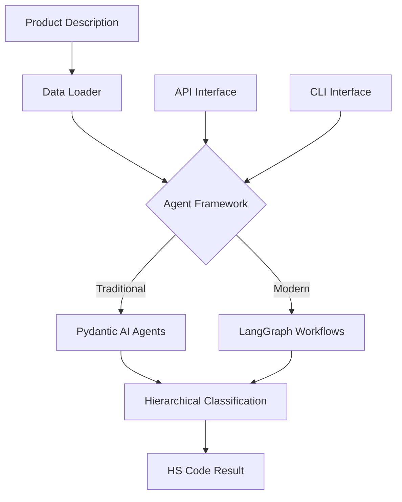

# HS Agent Documentation

Welcome to the comprehensive documentation for the HS Code Classification Agent system. This project provides advanced AI-powered classification of products into Harmonized System (HS) codes using both traditional and LangGraph-based agent frameworks.

!!! success "Recently Refactored"
    The HS Agent codebase has been **comprehensively refactored** for improved readability, maintainability, and developer experience. See the [Refactored Structure](architecture/refactored-structure.md) guide for details on the improvements.

## Overview

The HS Agent is a sophisticated classification system that helps automate the complex process of assigning HS codes to product descriptions. It supports multiple AI frameworks and provides both API and CLI interfaces for integration.

### Key Features

- **🤖 Multi-Framework Support**: Traditional Pydantic AI agents and modern LangGraph workflows
- **📊 Hierarchical Classification**: Progressive refinement from 2-digit to 6-digit HS codes
- **🌐 RESTful API**: FastAPI-based REST endpoints for easy integration
- **💻 Unified CLI Interface**: Beautiful command-line interface with rich formatting
- **⚙️ Centralized Configuration**: Type-safe configuration with validation
- **🚨 Comprehensive Error Handling**: Structured exceptions with detailed context
- **📝 Enhanced Logging**: Rich, structured logging with observability
- **🧪 Organized Testing**: Comprehensive test suite with fixtures and utilities
- **🏗️ Extensible Architecture**: Modular design for adding new workflows and agents

### Architecture



## Quick Navigation

=== "🚀 Getting Started"

    - [Installation](getting-started/installation.md) - Set up the project
    - [Quick Start](getting-started/quickstart.md) - Basic usage examples
    - [Configuration](getting-started/configuration.md) - Centralized configuration system

=== "📖 User Guide"

    - [Overview](user-guide/overview.md) - System overview
    - [CLI Usage](user-guide/cli-usage.md) - New unified command-line interface
    - [API Usage](user-guide/api-usage.md) - REST API examples

=== "🏗️ Architecture"

    - [Refactored Structure](architecture/refactored-structure.md) - **New improved codebase structure**
    - [System Design](architecture/system-design.md) - Overall system architecture
    - [Data Models](architecture/data-models.md) - Organized model structure

=== "🔧 Development"

    - [Testing](development/testing.md) - Organized testing framework
    - [Contributing](development/contributing.md) - Development guidelines
    - [Deployment](development/deployment.md) - Deployment strategies

## 🎯 New Unified CLI

The refactored HS Agent includes a beautiful, unified CLI interface:

```bash
# Classify products with rich formatting
hs-agent classify "Laptop computer with 16GB RAM"

# Use specific agent type
hs-agent classify "Cotton t-shirt" --agent langgraph

# Check system health
hs-agent health

# View configuration
hs-agent config --all
```

## 📋 System Requirements

- **Python 3.12+** - Modern Python with async/await support
- **Google Cloud Vertex AI API access** - For AI model inference
- **Langfuse (optional)** - For observability and tracing
- **Rich terminal support** - For beautiful CLI output

## License

This project is licensed under the MIT License. See the LICENSE file for details.