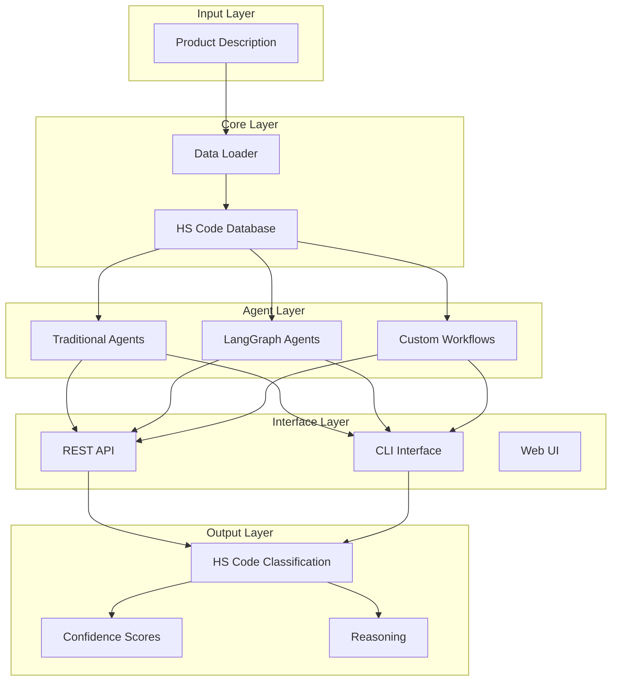

# System Overview

The HS Agent system is a comprehensive solution for automated Harmonized System (HS) code classification. It provides multiple approaches to classify products into the correct HS codes using advanced AI techniques.

## What are HS Codes?

The Harmonized Commodity Description and Coding System (HS) is an internationally standardized system of names and numbers to classify traded products. HS codes are organized hierarchically:

- **2-digit codes**: Chapters (e.g., 84 = Nuclear reactors, boilers, machinery)
- **4-digit codes**: Headings (e.g., 8471 = Automatic data processing machines)
- **6-digit codes**: Subheadings (e.g., 847130 = Portable digital processing units)

## Architecture Overview



## Classification Process

The system uses a hierarchical approach to classification:

### 1. Data Loading
- Loads HS codes from CSV files
- Builds hierarchical relationships
- Indexes product examples

### 2. Candidate Generation
- Text similarity search against HS descriptions
- Returns ranked candidates at each level
- Uses TF-IDF vectorization for efficiency

### 3. AI-Powered Ranking
- LLM evaluates candidates against product description
- Provides reasoning for selections
- Assigns confidence scores

### 4. Progressive Refinement
- Starts with 2-digit classification (chapters)
- Refines to 4-digit (headings)
- Final classification at 6-digit level (subheadings)

## Agent Frameworks

### Traditional Agents (Pydantic AI)

- **Technology**: Pydantic AI with Google Vertex AI
- **Approach**: Structured prompting with typed responses
- **Benefits**: Fast, reliable, well-tested
- **Use Cases**: Production deployments, batch processing

```python
from hs_agent.agents.traditional.classifier import HSClassifier

classifier = HSClassifier(data_dir="data", model_name="gemini-2.5-flash")
result = await classifier.classify("Laptop computer")
```

### LangGraph Agents

- **Technology**: LangGraph with LangChain
- **Approach**: Graph-based workflows with state management
- **Benefits**: Complex workflows, better observability
- **Use Cases**: Research, complex multi-step classifications

```python
from hs_agent.agents.langgraph.classifier import HSLangGraphClassifier

classifier = HSLangGraphClassifier(data_dir="data")
result = await classifier.classify("Laptop computer")
```

## Data Models

The system uses Pydantic models for type safety and validation:

### Core Models
- `HSCode`: Represents an HS code with metadata
- `ClassificationResult`: Results at each hierarchical level
- `FinalClassification`: Complete classification with confidence

### Request/Response Models
- `ClassificationRequest`: API request structure
- `ClassificationResponse`: API response structure
- `HSCandidate`: Individual candidate with reasoning

## Performance Characteristics

### Throughput
- **Traditional Agents**: ~10-20 classifications/minute
- **LangGraph Agents**: ~5-15 classifications/minute
- **Batch Processing**: Up to 100+ items with proper batching

### Accuracy
- **Chapter Level (2-digit)**: >95% accuracy
- **Heading Level (4-digit)**: >90% accuracy
- **Subheading Level (6-digit)**: >85% accuracy

### Latency
- **Single Classification**: 3-10 seconds
- **Data Loading**: 2-5 seconds (one-time)
- **API Response**: <15 seconds typical

## Integration Options

### REST API
- FastAPI-based endpoints
- OpenAPI/Swagger documentation
- Async support for high throughput

### Command Line Interface
- Interactive and batch modes
- Progress tracking for large datasets
- Export to various formats

### Python SDK
- Direct integration in Python applications
- Async/await support
- Full type hints and documentation

## Security Considerations

- **API Keys**: Secure storage of Google Cloud credentials
- **Rate Limiting**: Built-in protection against abuse
- **Input Validation**: Comprehensive validation of all inputs
- **Audit Logging**: Optional integration with Langfuse for tracing

## Monitoring and Observability

### Logging
- Structured logging with context
- Classification performance metrics
- Error tracking and alerting

### Tracing (Optional)
- Langfuse integration for LLM call tracing
- Performance monitoring
- Cost tracking for AI operations

### Metrics
- Classification accuracy over time
- Response time percentiles
- Error rates by classification type