# Wide Net Classification: An Intelligent Approach to HS Code Classification

## ⏱️ Executive Summary (TL;DR)

**What is it?**
An AI system that classifies products by exploring multiple options simultaneously (casting a "wide net") before selecting the single best HS code.

**How is it different?**
Traditional AI picks one path and hopes it's right. Our system maps out 2-3 different paths, compares them side-by-side, and picks the winner based on evidence.

**Why use it?**
*   **Accuracy:** Significantly reduces errors by considering alternatives.
*   **Defensibility:** Provides a "paper trail" for customs, explaining why other codes were rejected.
*   **Confidence:** You get one final answer, but with the certainty that it beat out the competition.

**Cost:** ~$0.06 per classification (higher than traditional methods, but optimized for accuracy).

**Best for:** High-value shipments, ambiguous products, and trade compliance teams.

---

## Introduction

The **Wide Net Classification** system is an innovative AI approach to classifying products into Harmonized System (HS) codes. Unlike traditional methods that commit to a single answer early on, this system explores multiple possibilities before selecting the best one - similar to how an expert would consider various options before making a final decision.

### The Challenge

Imagine you're classifying a product into the HS code system - a hierarchical tree with 98 main branches (chapters), each splitting into smaller branches (headings), and then into specific leaves (subheadings). Traditional systems pick one branch early and follow it all the way down. But what if that early choice was wrong? You'd end up at the wrong final destination.

**Example:** A "cotton t-shirt" could potentially fit into:
- Chapter 61 (Knitted clothing)
- Chapter 62 (Woven clothing)
- Chapter 63 (Other textile articles)

If you choose the wrong chapter at the start, everything else will be wrong too.

### The Wide Net Solution

Our system works like a thorough researcher who:
1. **Explores Multiple Options** - Considers 2-3 possibilities at each level instead of just one
2. **Maps Complete Paths** - Creates full classification paths from start to finish for each option
3. **Compares All Options** - Evaluates all paths side-by-side before deciding
4. **Selects the Best** - Chooses the single most accurate code with clear reasoning

**Result:** ONE HS code with high confidence, backed by evidence that alternatives were considered and rejected for good reasons.

---

## How the System Works: Two-Phase Approach

The classification process happens in two distinct phases. The **Path Exploration Tree** below visualizes how the system casts a "wide net" by splitting into multiple branches at every level.

```mermaid
graph LR
    %% Node Styles matching the screenshot
    classDef selected fill:#10b981,stroke:#059669,color:white,stroke-width:2px;
    classDef explored fill:#bfdbfe,stroke:#3b82f6,color:black;
    classDef root fill:#10b981,stroke:#059669,color:white;
    classDef phase fill:#fff,stroke:#ddd,stroke-dasharray: 5 5;

    subgraph Phase1 [PHASE 1: EXPLORATION - The Wide Net]
        direction LR
        Root(Product Description):::root

        %% Chapter Level (Split 1)
        Root --> Ch61(Ch 61<br/>Knitted):::selected
        Root --> Ch62(Ch 62<br/>Woven):::explored

        %% Heading Level (Split 2) - Exploration expands
        Ch61 --> H6109(6109<br/>T-shirts):::selected
        Ch61 --> H6105(6105<br/>Shirts):::explored

        Ch62 --> H6205(6205<br/>Shirts):::explored
        Ch62 --> H6211(6211<br/>Other):::explored

        %% Subheading Level (Split 3) - Leaves
        H6109 --> S610910(610910<br/>Cotton):::selected
        H6109 --> S610990(610990<br/>Other):::explored

        H6105 --> S610510(610510<br/>Cotton):::explored

        H6205 --> S620520(620520<br/>Cotton):::explored
        H6205 --> S620590(620590<br/>Other):::explored

        H6211 --> S621132(621132<br/>Cotton):::explored
    end

    subgraph Phase2 [PHASE 2: SELECTION]
        direction TB
        S610910 -.-> Comp[Comparison<br/>Agent]
        S610990 -.-> Comp
        S620520 -.-> Comp
        S620590 -.-> Comp
        S610510 -.-> Comp
        S621132 -.-> Comp

        Comp --> Final[🏆 SELECTED<br/>610910]:::selected
    end

    style Phase1 fill:#fcfcfc,stroke:#eee
    style Phase2 fill:#f9f9f9,stroke:#eee
```

### The Six Key Components

Think of the system as a team of specialized experts:

1. **The Coordinator** - Manages the overall process and keeps track of progress
2. **The Explorer** - Considers multiple options at each decision point
3. **Chapter Expert** - Identifies which main categories might fit (e.g., knitted vs woven apparel)
4. **Heading Expert** - Narrows down to specific product types (e.g., t-shirts vs shirts)
5. **Subheading Expert** - Pinpoints the exact classification (e.g., cotton vs other materials)
6. **The Judge** - Compares all complete paths and selects the best one

---

## Phase 1: Exploration (Casting a Wide Net)

In this phase, the system explores multiple classification possibilities at each level, keeping its options open rather than committing too early.

### Step 1: Identify Chapter Possibilities

**What happens:** The system looks at all 98 main categories in the HS system and identifies the 2-3 most likely matches for your product.

**Example for "Cotton t-shirt":**

**Why this matters:** By considering both knitted and woven categories, we don't prematurely rule out the correct answer.

### Step 2: Identify Heading Possibilities

**What happens:** For each chapter selected in Step 1, the system identifies 2-3 specific product types that might fit.

**Example:**

**Why this matters:** We're building paths down both branches - one specifically for t-shirts (6109) and one for general shirts (6205).

### Step 3: Identify Subheading Possibilities

**What happens:** For each heading selected in Step 2, the system identifies the most specific classifications based on material, construction, or other details.

**Example:**

**Why this matters:** We've reached the most specific level (6-digit codes). Now we have multiple complete paths from start to finish.

### Step 4: Build Complete Classification Paths

**What happens:** The system assembles all possible complete paths by connecting the chapters, headings, and subheadings selected in Steps 1-3.

**Result: Multiple Complete Paths**

**Why this matters:** We now have a complete picture of all reasonable classification options, each with its own confidence score and reasoning chain.

---

## Phase 2: Selection (Comparing and Choosing the Best)

In this phase, a specialized "comparison expert" evaluates all the paths built in Phase 1 and selects the single best HS code.

### Step 5: Expert Comparison and Final Selection

**What happens:** The system compares all paths side-by-side, considering multiple factors to determine which classification is most accurate.

```mermaid
graph LR
    classDef selected fill:#10b981,stroke:#059669,color:white;
    classDef explored fill:#bfdbfe,stroke:#3b82f6,color:black;
    classDef criteria fill:#fff4e1,stroke:#f59e0b,color:black;

    subgraph Inputs [Paths to Compare]
        P1(Path 1: 610910<br/>Knitted cotton):::selected
        P2(Path 2: 610990<br/>Knitted other):::explored
        P3(Path 3: 620520<br/>Woven cotton):::explored
    end

    P1 --> Judge{Comparison<br/>Expert}
    P2 --> Judge
    P3 --> Judge

    Judge --> Crit[Evaluation Criteria]:::criteria

    Crit --> C1[✓ Precision Match]:::criteria
    Crit --> C2[✓ Reasoning Quality]:::criteria
    Crit --> C3[✓ Legal Compliance]:::criteria
    Crit --> C4[✓ Trade Practice]:::criteria

    C1 --> Winner[🏆 SELECTED: 610910<br/>Confidence: 95%]:::selected
    C2 --> Winner
    C3 --> Winner
    C4 --> Winner
```

### What the Comparison Expert Considers

1. **Precision of Match**
   - Does the HS code description exactly match the product?
   - Example: "T-shirts, singlets and other vests" (6109) is more precise than "Men's shirts" (6205)

2. **Quality of Reasoning**
   - Is the reasoning at each level sound and well-justified?
   - Are there any weak spots or assumptions?

3. **Legal Compliance**
   - Does the path follow HS legal texts (chapter notes, section notes)?
   - Are there any exclusions or special rules that apply?

4. **Trade Practice**
   - Is this how customs typically classifies this type of product?
   - Would this classification hold up under scrutiny?

5. **Specificity**
   - Which code captures the product at the most detailed level?
   - More specific is generally better

### Example Final Decision

**Selected Code:** 610910

**Confidence:** 95%

**Reasoning:**
> "Path 1 (61→6109→610910) provides the most accurate classification. The product is explicitly described as a cotton t-shirt. T-shirts are characteristically knitted garments (even when not explicitly stated), which aligns with Chapter 61. Heading 6109 specifically covers 't-shirts, singlets and other vests, knitted or crocheted', providing exact product-code alignment. Path 3 through Chapter 62 (woven apparel) is less appropriate because t-shirts are predominantly knitted in construction, not woven. The cotton specification in subheading 610910 matches the product description perfectly. This classification is precise, defensible, and follows standard trade practice."

**Comparison Summary:**
> "I compared 3 complete classification paths. Path 2 was eliminated because the product clearly specifies cotton material. Path 3 (woven shirts) was less suitable because t-shirts are characteristically knitted, not woven. Path 1 provides superior precision with its explicit mention of t-shirts and correct identification of the knitted construction method."

---

## When Things Don't Fit: The "No Valid Code" Scenario

Sometimes a description cannot be classified in the HS system. The system uses a special code **"000000"** to indicate this.

### When "000000" is Returned

### Examples of "000000" Cases

**Example 1: Not a Physical Good**
- Input: "Software development services"
- Output: 000000
- Reason: Services are not classified in the HS system (which is for goods)

**Example 2: Category Indeterminate**
- Input: "Premium quality luxury item"
- Output: 000000
- Reason: Cannot determine what type of product this is

**Example 3: Just an Identifier**
- Input: "SKU-12345-XYZ"
- Output: 000000
- Reason: No information about what the product actually is

### When "000000" is NOT Returned

The system continues classification even when:
- Details are missing (e.g., "wooden table" without size/finish)
- Description is ambiguous (e.g., "cotton shirt" could be multiple types)
- Product is unusual or complex

In these cases, the system makes reasonable assumptions and adjusts confidence accordingly.

---

## Comparing Classification Approaches

### Feature Comparison

| Feature | Multi-Choice | Wide Net |
|---------|--------------|----------|
| **Explores alternatives** | Yes ✓ | Yes ✓ |
| **Automated final decision** | No ❌ | Yes ✓ |
| **Shows why chosen** | N/A | Detailed ✓ |
| **Compares options** | No ❌ | Yes ✓ |
| **Defensibility** | Medium | High ✓ |
| **Cost** | Medium | ~$0.06 / query |
| **Best for** | Decision support | Full automation |

### When to Use Each Approach

**Use Multi-Choice When:**
- Expert users want to see all options
- Human judgment is required
- Training and education purposes
- Decision support systems where a human makes the final click

**Use Wide Net When:**
- You need a single, definitive answer automatically
- Classification must be defensible (trade compliance)
- High-stakes decisions where accuracy is paramount
- You need documented reasoning for customs audits

---

## Key Advantages of Wide Net Classification

### 1. Thoroughness Without Overwhelm

Unlike systems that show you many options without guidance, Wide Net gives you one clear answer after considering alternatives.

### 2. Higher Confidence

Because the system explores alternatives before deciding, the final selection has higher confidence:

- **Traditional:** "This is probably the right code" (based on one path)
- **Wide Net:** "This is the right code - I compared it to X, Y, and Z" (based on comparative analysis)

### 3. Defensibility for Trade Compliance

When customs asks "Why did you use this code?", you can show:
- What alternatives were considered
- Why each was rejected
- Detailed reasoning for the selected code

### 4. Transparency

Every decision is documented:
- Which options were considered at each level
- Why each option was selected or rejected
- How the final comparison was made
- Legal compliance checks performed

### 5. Flexibility

The system can be adjusted for different needs:
- **More exploration:** Increase number of options considered (2-3 per level)
- **Less exploration:** Reduce to 1-2 options for faster processing
- **Different emphasis:** Weight different factors (legal compliance vs trade practice)

---

## Trade-offs and Cost

### What You Gain

✓ **Thoroughness** - Alternatives are systematically explored
✓ **Confidence** - Final decision is comparative, not absolute
✓ **Defensibility** - Can demonstrate due diligence to customs
✓ **Transparency** - Full reasoning chain is documented
✓ **Automation** - No human intervention needed

### What It Costs

✗ **Cost** - Approximately **$0.06 per query** (due to multiple AI calls)
✗ **Time** - Takes 3-5 seconds per classification
✗ **Complexity** - More sophisticated system to maintain

### The Bottom Line

Wide Net Classification is designed for scenarios where **quality and defensibility matter more than speed**. It's ideal for:

- Products with ambiguous classifications
- High-value shipments
- Trade compliance requirements
- Customs disputes and audits
- Products where classification directly impacts duty rates

---

## System Performance

### Typical Processing Times

### Path Exploration Examples

| Product Type | Paths Explored | Processing Time | Outcome |
|--------------|----------------|-----------------|---------|
| Cotton t-shirt | 2-3 paths | 3 seconds | Clear winner selected |
| Leather bag with metal parts | 6-8 paths | 5 seconds | Multiple materials compared |
| Multi-functional tool | 10-12 paths | 7 seconds | Primary function determined |

---

## Configuration and Customization

The system can be tuned for different scenarios:

### Exploration Breadth

**Recommendation:** Start with 2-3 selections for best balance of thoroughness and efficiency.

### The Funnel Strategy

The system uses a "funnel" approach by default:

**Why this works:** Early mistakes are most costly, so we explore more at the chapter level where one wrong choice locks us into the wrong part of the classification tree.

---

## Summary: The Wide Net Advantage

### The Core Innovation

### Key Takeaways

1. **Two-Phase Approach**
   - Phase 1: Explore multiple possibilities (cast wide net)
   - Phase 2: Compare and select single best code

2. **Five-Step Process**
   - Step 1: Consider chapter options (2-3 main categories)
   - Step 2: Consider heading options (specific product types)
   - Step 3: Consider subheading options (detailed classifications)
   - Step 4: Build complete paths (all combinations)
   - Step 5: Compare and select (choose the best)

3. **Expert-Like Reasoning**
   - Considers alternatives before deciding
   - Provides detailed justification
   - Checks legal compliance
   - Follows trade best practices

4. **Optimized for Quality**
   - Higher confidence through comparison
   - Defensible for customs and compliance
   - Transparent decision-making
   - Automated end-to-end

### When to Use Wide Net

✓ **Perfect for:**
- Ambiguous products with multiple possible classifications
- High-stakes classifications affecting duty rates
- Trade compliance and customs documentation
- Products requiring defensible decisions
- Cases where you need to show due diligence

✗ **Not needed for:**
- Simple, obvious classifications
- High-volume, time-critical batch processing
- Low-stakes decisions
- Cases where "good enough" is acceptable

---

## Appendix: Understanding HS Code Structure

For reference, here's how HS codes are organized:

**Chapter (2-digit):** 98 main categories covering all tradeable goods
**Heading (4-digit):** Specific product types within each chapter
**Subheading (6-digit):** Most detailed level with material, construction, or use specifications

---

## Glossary of Terms

**Chapter** - The first 2 digits of an HS code, representing a broad product category (e.g., "61" for knitted apparel)

**Heading** - The first 4 digits of an HS code, representing a specific product type (e.g., "6109" for t-shirts)

**Subheading** - The full 6-digit HS code, representing the most detailed classification (e.g., "610910" for cotton t-shirts)

**Classification Path** - A complete route from chapter through heading to subheading, with reasoning at each level

**Chapter Notes** - Legal texts that define what products belong (or don't belong) in each chapter

**Confidence Score** - A percentage (0-100%) indicating how certain the system is about a classification

**Wide Net** - The strategy of exploring multiple options at each level before deciding

**Comparison** - The process of evaluating all complete paths to select the best one

**000000 Code** - A special code indicating that no valid HS classification exists for the input

**Trade Compliance** - Following customs regulations and classification rules for international trade
